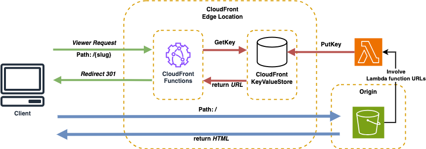

# aws_short_url


sleek repository crafted for constructing a simple URL shortener service harnessing the prowess of AWS CloudFront.

## Requirements

```bash
$ node --version
# v18.8.0
$ npm --version
# 8.18.0
$ yq --version
# yq (https://github.com/mikefarah/yq/) version 4.25.2
$ jq --version
# jq-1.6
$ task --version
# Task version: v3.33.1 (h1:JJSRANHH7RQrr5Z2CTvSnTH7iWlfBlKV2W2O0JiZoLk=)
$ aws --version
# task aws-cli/2.15.8 Python/3.11.7 Darwin/23.2.0 source/x86_64 prompt/off
$ terraform -v
# Terraform v1.5.1
$ terragrunt -v
# terragrunt version v0.46.2
```
## Deploy
I introduce Terragrunnt for deploy infrastructure, and all cli command run by Task.

Prepare:
```bash
$ task prepare:main
```

Deploy:
```bash
$ task deploy:main
```

Cleanup:
```bash
$ task destroy:main
```

## License
MIT License
